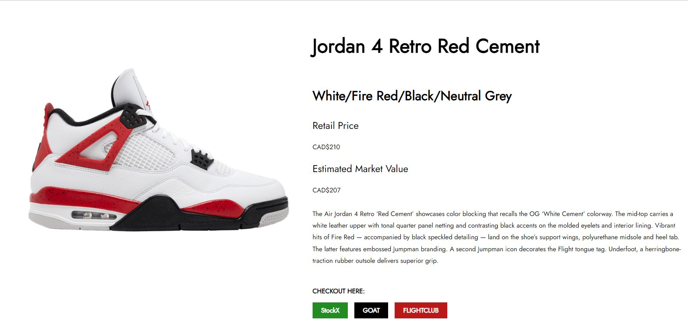
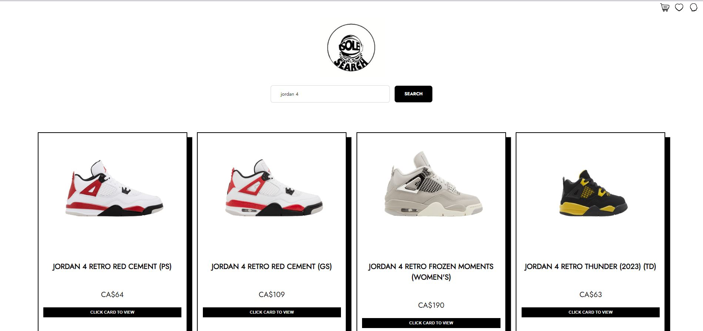

<<<<<<< HEAD
Sole Search is your ultimate sneaker database application, providing extensive details about various sneaker models, brands, release dates, and current market prices.

## 📸 Screenshots

## 🚀 Features
- **Expansive Sneaker Database**: Explore details about your favorite sneakers, from classic models to the latest releases.
- **Brand-wise Browsing**: Navigate through various brands and explore their available models.
- **Sneaker Authentication**: Verify the authenticity of sneakers using our extensive database.
- **Price Checker**: Check and compare prices from various retailers.
- **Upcoming Releases**: Stay informed about upcoming sneaker releases.
  
## 🛠️ Getting Started
To get started with Sole Search, clone the repository and follow the setup instructions.

## Installation

- Clone the repository
git clone https://github.com/ralphdaryn/sole-search.git

- Navigate to the project directory
cd solesearch

- Install dependencies
npm install

- Start the development server
npm start

## 🛠️ Tech Stack

- **React**: For dynamic user interface components.
- **SCSS**: Syntactically Awesome Style Sheets, a CSS preprocessor.
- **Node Express**: Back-end framework for Node.js.
- **React Router**: Declarative routing for React apps.
- **Axios**: HTTP client used for API calls to browser & Node.js.
- **Nodemon**: Monitors changes and automatically restarts the server.
- **React Icons**: Integrate popular icons into React projects.
- **Postman**: Provides a user-friendly interface to send requests to web services and view their responses in return.

## 🌐 API Reference

- **Zylalabs**: Sneakers Database API: https://zylalabs.com/api-marketplace/data/sneakers+database+api/

## 🧠 Lessons Learned

1. Planning and Scope Management
Challenge: Defining clear boundaries and scope of the application during initial stages.
Lesson: Early and thorough planning, involving all stakeholders to define and agree upon project boundaries and functionalities, is crucial.
Action for Future: Engage in a detailed scope definition phase and ensure all stakeholders agree upon functionalities and project limitations.

2. API Integration and Data Management
Challenge: Encountering unforeseen limitations and issues while integrating external APIs.
Lesson: Even widely-used APIs may present unexpected challenges, such as data inconsistency or request limitations.
Action for Future: Conduct a thorough initial review of API documentation and test endpoint behaviors to uncover potential issues early in the project.

3. User Experience (UX) and Interface Design
Challenge: Ensuring an intuitive and seamless user experience across all functionalities.
Lesson: User feedback is invaluable in identifying UX issues and refining interface design.
Action for Future: Implement user testing phases earlier in the project to gather actionable feedback for UX improvements.

4. Security and Sensitive Data Management
Challenge: Safeguarding API keys and sensitive user data.
Lesson: Security is paramount and should be considered throughout the development process, not just at deployment.
Action for Future: Adopt a security-first approach, ensuring all code, especially that which handles sensitive data, adheres to best security practices.

5. Collaboration and Communication
Challenge: Maintaining effective communication among remote team members.
Lesson: Consistent and clear communication is vital to keeping the project on track and managing team member expectations.
Action for Future: Employ collaborative tools and establish regular check-in meetings to foster communication and collaboration among team members.

6. Testing and Quality Assurance
Challenge: Managing comprehensive testing within project timelines.
Lesson: Early and ongoing testing is crucial to identify and resolve issues before they impact project timelines or outputs.
Action for Future: Incorporate testing into all stages of development and utilize automated testing tools to streamline the process.

7. Deployment and User Adoption
Challenge: Ensuring a smooth deployment and encouraging user adoption.
Lesson: A well-planned deployment strategy and post-launch marketing are vital to raise awareness and drive user adoption.
<<<<<<< HEAD
Action for Future: Develop a detailed deployment and marketing strategy to streamline launch processes and maximize initial user engagement.
=======
Action for Future: Develop a detailed deployment and marketing strategy to streamline launch processes and maximize initial user engagement.
>>>>>>> c8859e27a6d83e9d85c430322afc518d7f57cf04
=======
>>>>>>> ccb79f2d4d068c3d5d3adc3b4432030adf78acce
